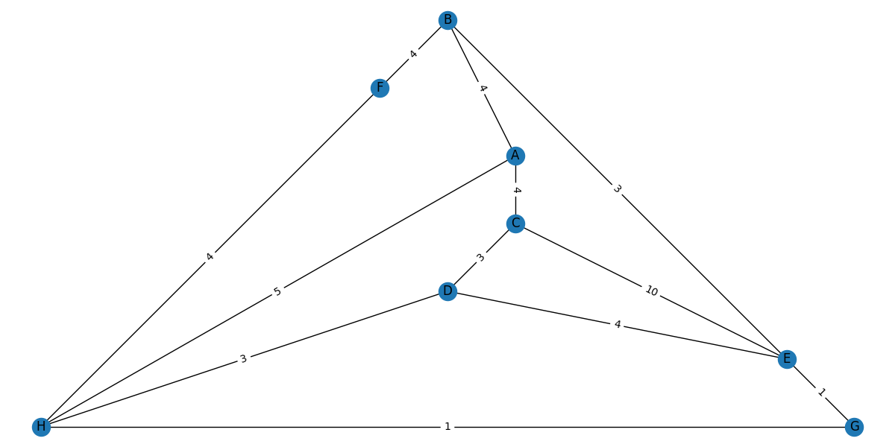
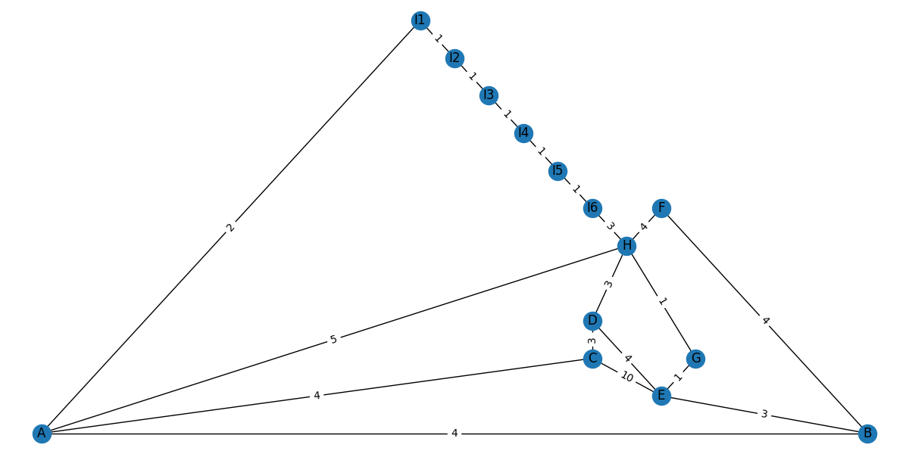

# Shortest Path and Fuel Constraints

## 1. Shortest Path
You are given a map of cities and time for travel between them in minutes
as a weighted undirected graph. You want to go from city s to city t. However, your
car tank can only hold enough fuel to drive for C minutes. There are gas stations
in all cities, but no gas stations between cities.

You need to find the shortest time without running out of gas. You can refuel as many times as you want, but each
refueling takes R minutes.

### Command
python shortest_path.py
### Sample Output 
Source: A \
Destination: H \
Time Taken: 13 \
Fuel Left: 3

## 2. Minimum Tank Capacity
You are given a map of cities and time for travel between them in minutes
as a weighted undirected graph. You want to go from city s to city t. However, your
car tank can only hold enough fuel to drive for C minutes. There are gas stations
in all cities, but no gas stations between cities.

Suppose you want to buy a car that has the minimum tank
capacity (measured in C minutes) needed to be able to drive from s to t.

### Command:
python min_tank_capacity.py
### Sample Output 
Source: A \
Destination: H \
Minimum Tank Capacity Required: 3
